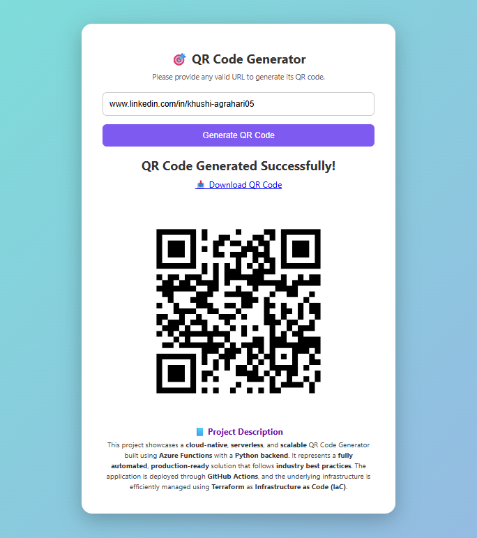

# 🚀 QR Code Generator using Azure Functions, Terraform, and GitHub Actions


**Author:** Khushi Agrahari  
🔗 [LinkedIn](https://www.linkedin.com/in/khushi-agrahari05)  
🔗 [GitHub Repository](https://github.com/khushia05/qr-generator-function-app)

---

## ✨ Demo

> 📷 **UI Screenshot**


> 📷 **QR Code Output**




## 📌 Project Overview


A serverless, fully automated **QR Code Generator** built using **Python**, hosted on **Azure Functions**, and deployed using **Terraform** and **GitHub Actions**. The application allows users to enter any text or URL and returns a downloadable QR code image, all without managing any server manually.

---

## 🎯 Objectives

- **Develop** a Python-based QR Code generator.
- **Deploy** using Azure Functions for serverless architecture.
- **Automate infrastructure** provisioning using Terraform.
- **Implement CI/CD** using GitHub Actions.
- **Minimize human error** and speed up deployments.
- **Demonstrate real-world DevOps and IaC** practices.

---

## 💡 Problem Statement

Manual QR code generation and infrastructure deployment is time-consuming, error-prone, and costly. This project solves these challenges by providing:

- Automatic QR code generation via API.
- No need for traditional server setup.
- Fully automated provisioning and deployment with zero manual intervention.

---

## 🛠️ Tech Stack

| 🐍 Python | ☁️ Azure Functions | ⚙️ Terraform | 🚀 GitHub Actions |
|-----------|---------------------|--------------|-------------------|

---

## 🏗️ Architecture & Execution Flow

1. User opens the web interface (`static-ui`).
2. Enters text/URL and clicks "Generate".
3. The frontend sends an HTTP request to `backend-api`.
4. QR code is generated using Python's `qrcode` library.
5. QR image is stored in Azure Blob Storage.
6. A downloadable image link is returned to the user.
7. All deployment is triggered automatically using GitHub Actions.

---

## 📁 Project Structure

```

qr-generator-function-app/
│
├── .github/workflows/
│   ├── deploy-azure-function-infra.yaml
│   └── deploy-app-code-function-app.yaml
│
├── Infra/
│   ├── main.tf
│   ├── provider.tf
│   ├── variables.tf
│   ├── outputs.tf
│   └── env/dev.tfvars
│
├── qr-generator/
│   ├── static-ui/
│   └── backend-api/
│
├── scripts/
│   └── automation-setup.ps1
│
├── README.md
└── requirements.txt, .gitignore, host.json, etc.

````

---

## ⚙️ How to Run This Project

### 🧪 Prerequisites

- Python 3.10+
- Azure CLI installed
- Terraform installed
- GitHub account with Actions enabled

---

### 🚀 Deployment Steps

```bash
# Clone the repository
git clone https://github.com/khushia05/qr-generator-function-app.git

# Navigate to Infra folder and deploy infra using Terraform
cd qr-generator-function-app/Infra
terraform init
terraform apply -var-file="env/dev.tfvars"
````

✅ **CI/CD** – GitHub Actions will automatically deploy code when you push changes.

---

### 🌐 Access Application

Open in browser:

```
https://functionapp-khushi-01.azurewebsites.net/api/static-ui
```

---

## 🧩 Example API Usage

You can also call the API directly:

```bash
curl -X POST \
  -H "Content-Type: application/json" \
  -d '{"data":"https://khushi.com"}' \
  https://functionapp-khushi-01.azurewebsites.net/api/backend-api
```

---

## ✅ Key Features

✅ Fully Automated Infrastructure & Deployment

✅ No Server Maintenance – pure serverless backend

✅ Reusable Terraform scripts

✅ Secure and scalable on Azure

✅ Clean separation of backend, frontend, and IaC

---

## 🔮 Future Enhancements

* 🗃️ **Database Integration** – Store generated QR history and metadata in Azure Cosmos DB for persistence and analytics.
* 🔐 **Secure Secrets Management** – Use Azure Key Vault to manage API keys and sensitive configuration securely.
* 🖼️ **QR Branding** – Support for logo overlays, colors, and custom design templates.
* 👥 **User Authentication** – Add login/signup features with Azure Active Directory B2C or social logins.


---

## 🤝 Contributing

Contributions, issues, and feature requests are welcome!

Feel free to check [issues page](https://github.com/khushia05/qr-generator-function-app/issues).

---

## 📝 License

This project is licensed under the MIT License.

---

## 📚 References

* [Azure Functions Documentation](https://learn.microsoft.com/en-us/azure/azure-functions/)
* [Terraform Docs](https://developer.hashicorp.com/terraform/docs)
* [GitHub Actions Docs](https://docs.github.com/en/actions)
* [Azure Free Trial](https://go.microsoft.com/fwlink/?linkid=2227353)

---

## 👩‍💻 Author

**Khushi Agrahari**
📧 [khushiagrhari05@gmail.com](mailto:khushiagrhari05@gmail.com)
🔗 [LinkedIn](https://www.linkedin.com/in/khushi-agrahari05/)
🔗 [GitHub](https://github.com/khushia05)

````

